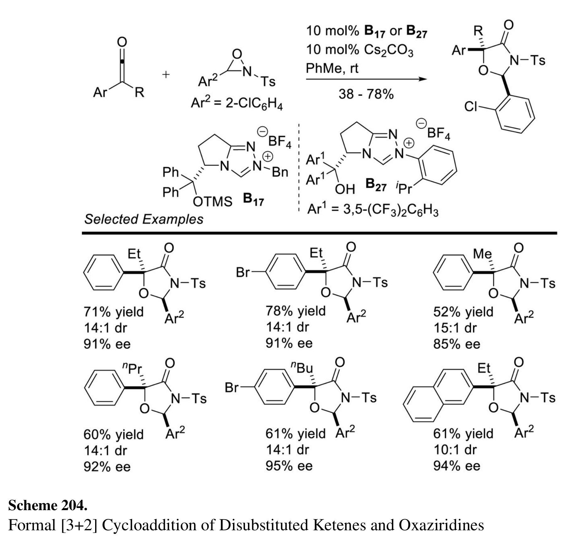
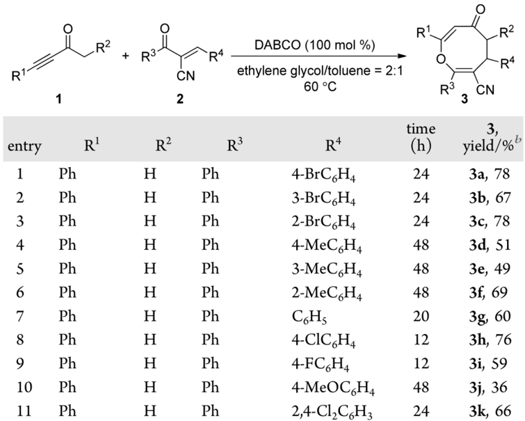
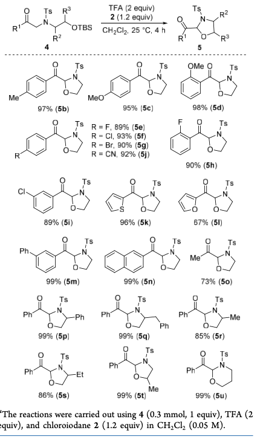
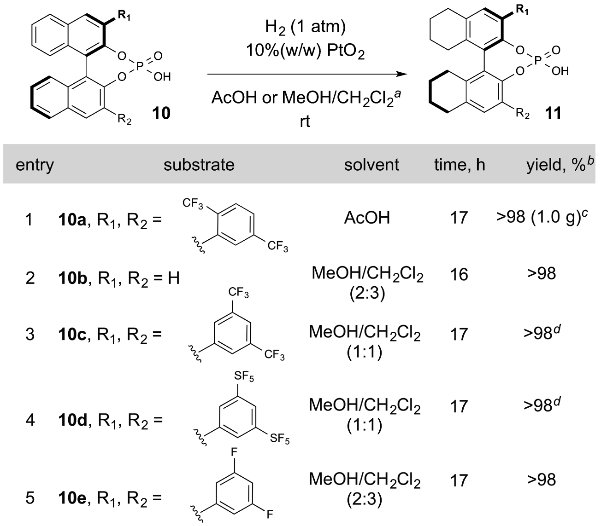

# ChemEAGLE
This is the official code of the paper "A Multi-Agent System Enables Versatile Information Extraction from the Chemical Literature"

## :sparkles: Highlights
<p align="justify">
In this work, we present ChemEAGLE, a multimodal large language model (MLLM)-based multi-agent system that integrates diverse chemical information extraction tools to extract multimodal chemical reactions. By integrating ten expert-designed tools and seven chemical information extraction agents, ChemEAGLE not only processes individual modalities but also utilizes MLLMs' reasoning capabilities to unify extracted data, ensuring more accurate and comprehensive reaction representations. By bridging multimodal gaps, our approach significantly improves automated chemical knowledge extraction, facilitating more robust AI-driven chemical research.

[comment]: <> ()

<div align="center"> An example workflow of ChemEAGLE. Each agent handles a specific sub-task, from reaction template parsing and molecular recognition to SMILES reconstruction and condition role interpretation, ensuring accurate, structured chemical data integration. </div>
  
### 🧩 Agents Overview
| Agent Name                                          | Category            | Main Function                                                       |
| --------------------------------------------------- | ------------------- | ------------------------------------------------------------------- |
| **Planner**                                   | Planning  | Analyzes input, plans extraction steps, assigns sub-tasks to agents |
| **Plan Observer**                          | Validation | Monitors extraction workflow, ensures logical plan                  |
| **Action Observer**                           | Validation | Oversees agent actions, validates consistency and correctness       |
| **Reaction Template Parsing Agent**                 | Extraction          | Parses reaction templates, integrates R-group substitutions         |
| **Molecular Recognition Agent**                     | Extraction          | Detects and interprets all molecules in graphics                      |
| **Structure-based Table R-group Substitution Agent** | Extraction          | Substitutes R-groups and reconstructs reactant SMILES from product variant structure-based tables        |
| **Text-based Table R-group Substitution Agent**     | Extraction          | Substitutes R-groups and reconstructs SMILES from text-based tables  |
| **Condition Interpretation Agent**                  | Extraction          | Extracts and categorizes reaction conditions (solvent, temp, etc.)  |
| **Text Extraction Agent**                           | Extraction          | Extracts and aligns reaction info from associated texts             |
| **Data Structure Agent**                            | Output         | Compiles structured output for downstream applications              |


### 🛠️ Toolkits Used in ChemEAGLE
| Tool Name               | Category                          | Description                                            |
| ----------------------- | --------------------------------- | ------------------------------------------------------ |
| **TesseractOCR**        | Computer Vision                   | Optical character recognition for text in graphics       |
| **TableParser**         | Computer Vision                   | Table structure detection and parsing                  |
| **MolDetector**         | Computer Vision                   | Locates and segments molecules within graphics           |
| **MolNER**              | Text-based Information Extraction | Chemical named entity recognition from text            |
| **ChemRxnExtractor**    | Text-based Information Extraction | Extracts chemical reactions and roles from text        |
| **Image2Graph**         | Molecular Recognition             | Converts molecular sub-images to graph representations     |
| **Graph2SMILES**        | Molecular Recognition             | Converts molecular graphs to SMILES strings            |
| **SMILESReconstructor** | Molecular Recognition             | Reconstructs reactant SMILES from product variants     |
| **RxnImgParser**        | Reaction Image Parsing            | Parsing reaction template images into bounding boxes and components |
| **RxnConInterpreter**   | Reaction Image Parsing            | Assigns condition roles to extracted condition text     |


## :rocket: Using the code for ChemEAGLE
### Using the code
Clone the following repositories:
```
git clone https://github.com/CYF2000127/ChemEagle
```
### Example usage of the ChemEAGLE
1. First create and activate a [conda](https://numdifftools.readthedocs.io/en/stable/how-to/create_virtual_env_with_conda.html) environment with the following command in a Linux, Windows, or MacOS environment (Linux is the most recommended):
```
conda create -n chemeagle python=3.10
conda activate chemeagle
```

2. Then install requirements:
```
pip install -r requirements.txt
```
3. Download the necessary [models](https://huggingface.co/datasets/CYF200127/ChemEagle/tree/main) and put in the main path.

4. Set up your Azure OpenAI API key in your environment. Here is a detailed [tutorial](https://zhuanlan.zhihu.com/p/678367436) on how to obtain the Azure OpenAI API key and endpoint.
```
export API_KEY=your-azure-openai-api-key
export AZURE_ENDPOINT=your-azure-endpoint
export API_VERSION=your-api-version
```

4. Run the following code to extract machine-readable chemical data from a chemical graphics:
```python
from main import ChemEagle
image_path = './examples/1.png'
results = ChemEagle(image_path)
print(results)
```

### Benchmarking
All benchmark datasets, predictions, and ground truth can be found in our [Huggingface Repo](https://huggingface.co/datasets/CYF200127/ChemEagle/blob/main/Dataset.zip).

## 🤗 Chemical information extraction using [ChemEAGLE.Web](https://huggingface.co/spaces/CYF200127/ChemEagle) 

Go to our [ChemEAGLE.Web app demo](https://huggingface.co/spaces/CYF200127/ChemEagle) to directly use our tool online!

When the input is a multimodal chemical reaction graphic:

<div align="center",width="100">
</div> 

The output dictionary is a complete machine-readable reaction list with reactant SMILES, product SMILES, detailed conditions and additional information for every reaction in the graphics:

``` 
{
"reactions":[
{"reaction_id":"0_1",###Reaction template
"reactants":[{"smiles":"*C(*)=O","label":"1"},{"smiles":"Cc1ccc(S(=O)(=O)N2OC2c2ccccc2Cl)cc1","label":"2"}],
"conditions":[{"role":"reagent","text":"10 mol% B17 orB27","smiles":"C(C=CC=C1)=C1C[N+]2=CN3[C@H](C(C4=CC=CC=C4)(C5=CC=CC=C5)O[Si](C)(C)C(C)(C)C)CCC3=N2.F[B-](F)(F)F","label":"B17"},{"role":"reagent","text":"10 mol% B17 or B27","smiles":"CCCC(C=CC=C1)=C1[N+]2=CN3[C@H](C(C1=CC(=CC(=C1C(F)(F)F)C(F)(F)F))(C1=CC(=CC(=C1C(F)(F)F)C(F)(F)F))O)CCC3=N2.F[B-](F)(F)F","label":"B27"},{"role":"reagent","text":"10 mol% Cs2CO3","smiles":"[Cs+].[Cs+].[O-]C(=O)[O-]"},{"role":"solvent","text":"PhMe","smiles":"Cc1ccccc1"},{"role":"temperature","text":"rt"},{"role":"yield","text":"38-78%"}],
"products":[{"smiles":"*C1*O[C@H](c2ccccc2Cl)N(S(=O)(=O)c2ccc(C)cc2)C1=O","label":"3"}]},

{"reaction_id":"1_1",###Detailed reaction 
"reactants":[{"smiles":"CCC(=O)c1ccccc1","label":"1a"},{"smiles":"Cc1ccc(S(=O)(=O)N2OC2c2ccccc2Cl)cc1","label":"2"}],
"conditions":[{"role":"reagent","text":"10 mol% B17 or B27","smiles":"C(C=CC=C1)=C1C[N+]2=CN3[C@H](C(C4=CC=CC=C4)(C5=CC=CC=C5)O[Si](C)(C)C(C)(C)C)CCC3=N2.F[B-](F)(F)F","label":"B17"},{"role":"reagent","text":"10 mol% B17 or B27","smiles":"CCCC(C=CC=C1)=C1[N+]2=CN3[C@H](C(C1=CC(=CC(=C1C(F)(F)F)C(F)(F)F))(C1=CC(=CC(=C1C(F)(F)F)C(F)(F)F))O)CCC3=N2.F[B-](F)(F)F","label":"B27"},{"role":"reagent","text":"10 mol% Cs2CO3","smiles":"[Cs+].[Cs+].[O-]C(=O)[O-]"},{"role":"solvent","text":"PhMe","smiles":"Cc1ccccc1"},{"role":"temperature","text":"rt"},{"role":"yield","text":"71%"}],
"products":[{"smiles":"CC[C@]1(c2ccccc2)O[C@H](c2ccccc2Cl)N(S(=O)(=O)c2ccc(C)cc2)C1=O","label":"3a"}],
"additional_info":[{"text":"14:1 dr, 91% ee"}]},

{"reaction_id":"2_1",... ###More detailed reactions}
],
"text_extraction":"..."
}
```
The input can be any chemical graphics; feel free to try more examples! 
(NOTE: If the local CPU is larger than 8 cores, it is recommended to use the local code, which will be faster than the web demo. It will also be significantly faster using a GPU. The current version runs by default on the CPU for stability. The online version may not be as updated as the GitHub version.)





## :warning: Acknowledgement
1. In our experiments, we observed that GPT-4o outputs can differ across API versions and endpoints. We use api_version="2024-06-01" with the HKUST Azure OpenAI endpoint as our official version.
2. Our code is based on [MolNexTR](https://github.com/CYF2000127/MolNexTR), [MolScribe](https://github.com/thomas0809/MolScribe), [RxnIM](https://github.com/CYF2000127/RxnIM), [RxnScribe](https://github.com/thomas0809/RxNScribe), [ChemNER](https://github.com/Ozymandias314/ChemIENER), [ChemRxnExtractor](https://github.com/jiangfeng1124/ChemRxnExtractor), [AutoAgents](https://github.com/Link-AGI/AutoAgents), and [Azure OpenAI](https://azure.microsoft.com/).


